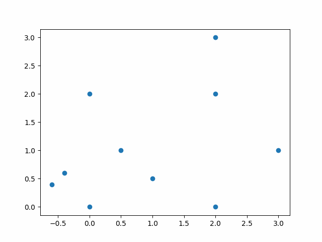

## About Me

Welcome to my webpage! I am a Ph.D. candidate at the [University of Maryland, College Park](https://www-math.umd.edu/), advised by [Yanir A. Rubinstein](https://math.umd.edu/~yanir/). I am currently in my sixth year, and plan to graduate Spring 2025. I am interested in geometric analysis, convex geometry, several complex variables, and geometric flows.

I received my undergraduate degree from the [University of Athens](https://www.math.uoa.gr/) in 2017, and completed the [Part III of the Mathematical Tripos](https://www.maths.cam.ac.uk/postgrad/part-iii/current) at Cambridge University in 2018. 



<!-- ## Research Interests

- **Computer Vision:** image recognition, image generation, video captioning
- **Machine Learning:** meta-learning, incremental learning, transfer learning -->

<!-- ## News

- **[Feb. 2020]** Our paper about incremental learning is accepted to CVPR 2020.
- **[Feb. 2020]** We will host the ACM Multimedia Asia 2020 conference in Singapore!
- **[Sept. 2019]** Our paper about few-shot learning is accepted to NeurIPS 2019.
- **[Mar. 2019]** Our paper about few-shot learning is accepted to CVPR 2019. -->



<!--  -->



## Code

[magicMahler](https://github.com/vmastr/magicMahler) is a Python library designed for geometric computations involving polytopes in the plane. Key features include calculating essential notions from my reserach:
- Lp-Mahler volumes
- The isotropic constant
- The B-constant
- Implementation of the Mahler algorithm
- Implementation of th Graham scan for finding the extreme points in nlogn time.

Here is an example of a Graham scan implementation: 

